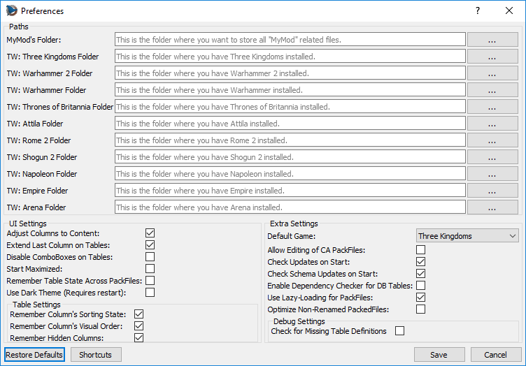
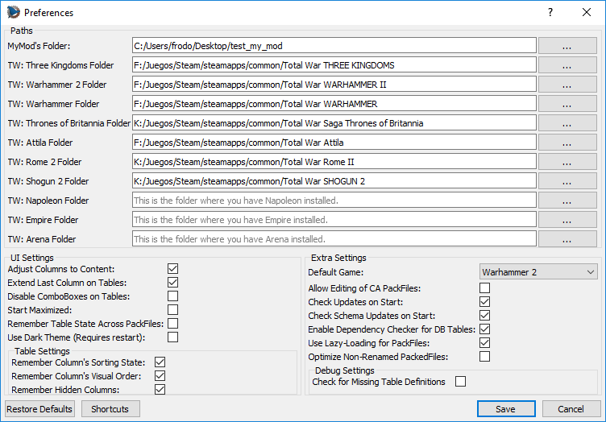
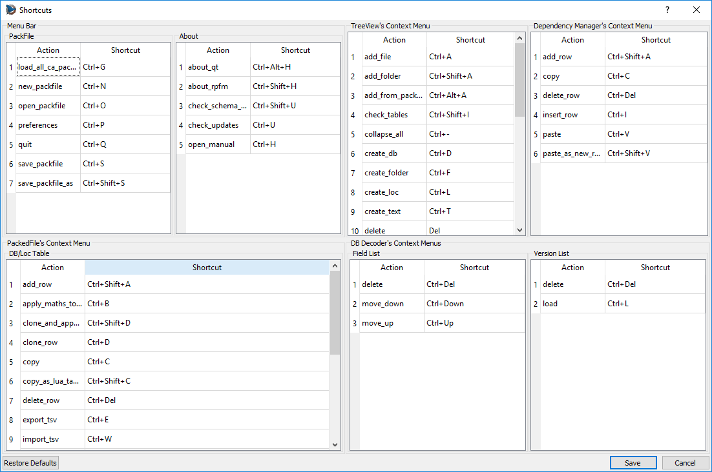

# Initial Configuration

After we start RPFM for the first time, we have to configure a couple of things. To do it, we need to go to `PackFile/Preferences`, and the window above this will popup. It seems like a lot of new stuff to know, but it's really simple. First the paths:
- `MyMod's folder`: it's the path where your ***MyMod*** will be stored. ***MyMod*** are explained in a later chapter of this documentation, so for now you just need to know that it's a path RPFM will use to store stuff for your mods. Set it pointing to an empty folder.
- `XXX folder`: These are the folders where your games are. RPFM uses them for plenty of things, so remember to set them for the games you have.

In the end, it should look something like this:

Next, the `Default Game`. RPFM uses a `Game Selected` setting to configure certain parts of the program to work with one game or another. For example, it changes the way the mods are saved, the default folder to save them, **the schema used for the tables**,.... Here you can set the game that'll be selected by default when you open the program.

Next, all those checkboxes. You can get an explanation about what they do just by hovering them with the mouse, like this.

There are a couple of settings that may need some aditional explanation:
- `Use Dark Theme`: Self-explanatory, but only available in Windows. The Linux version **uses the system's Qt Theme** instead.
- `Check for Missing Table Definition`: Debug setting to help me get the schemas done. Unless you're updating an schema, ***don't ever enable it!***

And finally, the `Shortcuts` button. Hitting it will open the `Shortcuts` window, where you can see and edit all the shortcuts currently used by RPFM.

Just keep in mind that some of **the shortcuts are applied when the program starts**, so you'll have to close and re-open RPFM for the changes to take effect.

When you're done with the settings, just hit `Save`. You can restore them to the defaults with the button of the left (same for the shortcuts with their `Restore Defaults` button). One thing to take into account is that, if any of the paths is invalid, RPFM will delete it when hitting `Save`.

Now the last step. This is optional, but recommendable and it **requires you to have the Assembly Kit** for your games installed. We have to go to `Special Stuff` and, for each game we have, hit `Generate PAK File`. This will create a special file that will help RPFM with reference data for table columns. It's **not enabled for Empire and Napoleon** for now, but it should work for every other game.

With that, we have completed the initial configuration. Starting on version 1.0, new updates should continue to work with the same settings/shortcuts (as long as new big things aren't added), updating them automatically in case a new setting/shortcut is introduced, storing the saved configurations in the files `settings.json` and `shortcuts.json`, in RPFM's folder.

So now that we're done configuring RPFM, let's take a look at the features it has to offer.
