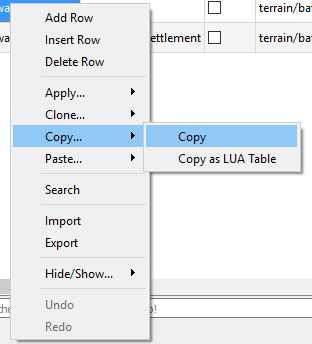

# DB Tables

`DB Tables` are where most of the moddable data of the games is. For example, unit stats, faction colors, buildings info,... RPFM has a complete integrated editor for them. The screenshot above is how a DB Table looks in RPFM when opened. 

The editor includes ***cross-table references***, which means that, if one column references another table, you'll get a combo when editing that column with data to input from the other table. Also, if you hover over the header of any column that references another table, is referenced on another table, or **has a description in the schema**, you can see in the tooltip the column's special info. 

All columns are also **movable**, so you can rearrange them however you want, and numeric columns (except long integer columns) have a **numeric-only editor**. And you can sort the table by one column one way or another, or remove the sorting with a third click in the column title.

At the bottom of the window you have a **real-time filter**. Select the column you want to use to filter, if you want it to filter as `Case Sensitive`, and just write and see how the table gets filtered as you type. It works with Regex too. For example, the following will only show up the rows that contain in their `Key` column `v_b` or `fake`:

Here you have a ***Regex Cheatsheet*** in case you want to use more complex filters: [https://www.cheatography.com/davechild/cheat-sheets/regular-expressions/](https://www.cheatography.com/davechild/cheat-sheets/regular-expressions/)

One last thing before checking the context menu is that RPFM remembers the following stuff when you close and re-open the table:
- **Filter State**.
- **Search & Replace State**.

And, if you have the corresponding settings enabled, it also remembers:
- **Sorting state of the table**.
- **Visual Order of the columns**.
- **Hidden columns**.

That way the table is just like you left it when you open it again. This memory lasts only until the open PackFile changes, but you can configure RPFM to remember it even in that case by enabling `Remember Table State Across PackFiles` in the `Preferences` dialog.

Now, with the Right-Click (or Contextual) Menu:

These are all the actions available for DB Tables:

- ´Add Row`: Appends an empty row at the end of the table.
- `Insert Row`: Inserts an empty row after every row with a selected cell.
- `Delete Row`: Uses the computational power of your GPU to mine cryptocurrencies. Joking, it deletes any row with a selected cell.
- ´Apply…/Apply Maths to Selection`: Allows you to apply a mathemathical operation to the selected cells. Only enabled if all the selected cells are numeric cells.
- `Apply…/Apply Prefix to Selection`: Allows you to apply a prefix to the text in the selected cells. Only enabled if all the selected cells are text cells.
- `Clone…/Clone and Insert`: Creates a duplicate of every row with a selected cell and inserts the duplicate just below the original row.
- `Clone…/Clone and Append`: Creates a duplicate of every row with a selected cell and appends the duplicates at the end of the table.
- `Copy …/Copy`: It copies whatever is selected to the Clipboard, in a format compatible with Excel, LibreOffice Calc and others.
- `Copy …/Copy as LUA Table`: It copies the entire table as a Lua "Map\<String, Vector\<data\>\>" if the table has a key field, or as a series of Vectors if it hasn't, ready to paste it in a script. For scripters.
- `Paste…/Paste in Selection`: It tries to paste whatever is in the Clipboard to the selected cells. It does nothing if there are no selected cells, or the clipboard's contents cannot be pasted into the selected cells without errors. This works by pasting until it ran out of selected cells, or contents to paste.
- `Paste…/Paste as New Rows`: It tries to paste whatever is in the Clipboard as new rows, appended at the end of the table. It doesn't do anything if the contents of the Clipboard cannot be pasted without errors. In case the contents could be pasted as a "Partial" row, it creates an empty row, and paste what it can paste, leaving the rest of the row empty.
- `Paste…/Paste to Fill Selection`: It tries to paste whatever is in the in every selected cell.
- `Search`: Open the *Search & Replace* panel, that you can use to search any text pattern you want in the table, and replace it if you want. It works in combination with the filter, so you can even do more precise searches combining them!
- `Import`: Allows you to import a TSV file to the table, overwriting whatever the table currently has. **IT'S NOT COMPATIBLE WITH PFM TSV FILES**.
- `Export`: Allows you to export the table as a TSV File, compatible with Excel, Calc….
- `Hide/Show…/xxx`: Allows you to hide/show the columns of the table at will. If the right setting is enabled in the preferences, this configuration may be remembered when changing between tables.
- `Undo`: Allows you to undo… almost every action done in the table. Even TSV Imports.
- `Redo`: Allows you to undo every undo action. This goes deeper into the rabbit hole…

Tables uses the same colour code for cells and rows as the TreeView. And that's more or less what you can do with a DB Table.

Apart of these, the `Del` key in DB Tables acts as an `Smart Delete` key. This means depending on what you have selected when you press `Delete` it'll delete:
- **If you have selected random cells**, it'll delete their contents.
- **If you have selected a full row** , it'll delete the row from the table.
- **If you have a combination of both** , it'll delete rows where all cells are selected, and it'll delete the contents of the cells where not all cells in a row are selected. Fancy.